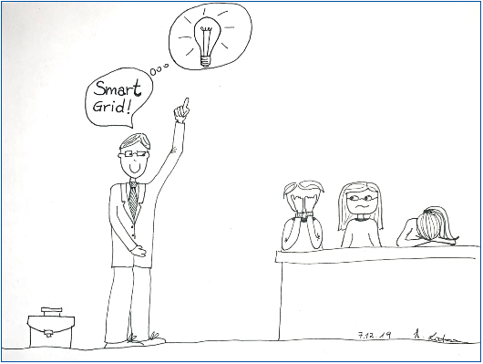

<!-- 
author:   Prof. Dr. Astrid Nieße, Silke Welter, Jingyu Yang, Julia Heiken
email:    
Version:  1.0
language: de
license:  http://creativecommons.org/licenses/by/4.0/

mode:     Presentation

narrator: US English Female

logo:   img/uol_logo.png

icon:   img/uol_logo.png

        
-->

# Smart Grid und Sektorkopplung

**Lernziele**

Nach Bearbeitung dieses Lernobjekts... 

- kennen Sie die Definition von und Anforderungen an Smart Grids
- wissen Sie, was Multimodale Systeme und Sektorkopplung sind und können Beispiele für Kopplungspunkte, Prozesskopplung und Prozessdistanzen nennen.
- kennen Sie Agentensysteme und deren Eigenschaften sowie Dynamic Virtual Power Plants 

## Smart Distribution Grid 
Das Energiesystem steht aktuell vor vielen verschiedenen Herausforderungen: 
Auf Ebene der Erzeugung, der Übertragung und der Verteilung muss mit fluktuierender dezentraler Einspeisung sinnvoll umgegangen werden, um die Substitution fossil befeuerter Kraftwerke in jedem Aspekt des Systembetriebs zu ermöglichen. Diese führt zu neuen Belastungen bei gleichzeitig alternder Infrastruktur. Zusätzlich ist auf der Verteilungsebene die Datenlage sowohl in Bezug auf statische (Betriebsmittel) als auch dynamische Daten (Messwerte, Schaltzustände) häufig noch schlecht. Außerdem sind steigender Kostendruck und Wettbewerb festzustellen und zumeist politisch gewünscht, während für die Verbraucherseite mehr Transparenz gefordert wird.

Smart Grids sollen dabei helfen, diese verschiedenen Aufgaben zu bewältigen. Die EU Plattform für 
Smart Grids hatte daher folgende Definition gefasst:

> **Smart Grid**
>
> Ein Smart Grid ist ein intelligent vernetztes Stromnetz, in dem alle Aktionen der verbundenen Nutzer (Erzeuger, Verbraucher und Nutzer, die beides sind) genutzt werden, um auf effiziente Weise eine  sichere, nachhaltige und wirtschaftliche Energieversorgung zu gewährleisten.
>
> Für Smart Grids werden neue, innovative Produkte und Services verwendet, die von intelligenten Technologien zur Steuerung, Überwachung, Kommunikation und Selbstheilung ergänzt werden. Damit sollen Erzeugungsanlagen jeder Technologieart und Größe leichter angebunden und betrieben werden können, sowie elektrischen Verbrauchern (Lasten) ermöglicht werden,  sich an der Optimierung des Energiesystems zu beteiligen. Es soll den Endnutzerinnen und Endnutzern (Kunden) außerdem mehr Informationen und eine größere Auswahl an Versorgungsoptionen bieten. Darüber hinaus sollen Smart Grids das Energieversorgungssystem wesentlich umweltfreundlicher machen und die Zuverlässigkeit und Sicherheit der Versorgung erhöhen.
> 
> Bei der Entwicklung von Smart Grids müssen viele Faktoren beachtet werden. Dazu gehören technologische, marktwirtschaftliche und kommerzielle Aspekte, sowie rechtliche Rahmenbedingungen, Umweltauswirkungen, Informations- und Kommunikationstechnologien (IKT), Migrationsstrategien und Standardisierung. Auch gesellschaftliche Anforderungen und behördliche Auflagen spielen hierbei eine Rolle.  ([European Technology Platform](http://kigeit.org.pl/FTP/PRCIP/Literatura/020_SmartGrids_ETP_SDD_FINAL_APRIL2010.pdf))

Smart Grids sollen also: 

- Kunden aktiv an Märkten teilnehmen lassen, 
- jede Art von Anlagen zur Energieumwandlung und Speicherung berücksichtigen, 
- neue Produkte, Dienste und Märkte ermöglichen, 
- die Anlagenbetriebsführung optimieren, 
- sich selbst heilen: Störungen vorher erkennen und selbständig reagieren, 
- stabil auch bei Angriffen und Naturereignissen agieren. 

Dabei stellen sich die folgenden nicht funktionalen Anforderungen (NFA):

- Restrukturierungsfähigkeit: Systemkomponenten sollen transparent integriert bzw. substituiert werden. 
- Security: Daten müssen aktiv geschützt werden und die Datenintegrität muss sicher gestellt werden. 
- Relokation von Funktionalität: Die Integration sollte plattformunabhängig sein. 
- Kompatibilität: Es sollte über längere Zeiträume eine Vorwärts- sowie Rückwärtskompatibilität sicher gestellt sein. 
- Skalierbarkeit: Eine Integration von einer Vielzahl von Erzeugern und Verbrauchern sollte möglich sein. 
- Safety: Das System muss robust und zuverlässig sein und darf keine einzelne Single-Point-of-Failure haben. 
- Integrierbarkeit: Bestehende Supervisory Control and Data Acquisition-Systeme müssen einzubinden sein. 
- Echtzeitfähigkeit: Um die Versorgungsqualität sicher zu stellen, müssen harte zeitliche Anforderungen erfüllt werden.

## Multimodale Netze 
Während die Energieinformatik sich zunächst vor allem auf die Aufbereitung und Bearbeitung von Fragestellungen aus dem Bereich der elektrischen Energiesysteme fokussiert hat, nimmt in den letzten Jahren der Anteil solcher Arbeiten zu, die eine Anpassung und Optimierung der Systeme über die Grenzen einzelner Sektoren hinaus befördert – sogenannte multimodale Systeme, die durch Sektorkopplung aus Wärme, Strom und Gas entstehen.

### Kopplungspunkte 
In sektorgekoppelten Systemen entstehen weitere Potentiale zur Optimierung über die sogenannten Kopplungspunkte hinweg. Kopplungspunkte treten immer da auf, wo sich der Bedarf in einem Energiesystem über eine Belieferung aus einem anderen Energiesystem speisen lässt, bzw. wo ein Energiesystem zur Pufferung oder Speicherung eines Überschusses in einem anderen nutzen lässt (in diesem Sinne handelt es sich auch hier um einen Bedarf, nämlich den zur Bewältigung eines Überschusses an einer Energieform, z.B. bei einem Überangebot an erneuerbar erzeugtem Strom).

")

Zur effizienteren Nutzung der Ressourcen versucht man Prozessdistanzen in Hybridnetzen zu minimieren. Dabei nutzt man „Smart Grid Methoden“ und ergänzende Methoden aus Gas/Wärme/Transport-Systemen, wie in Abbildung 2 dargestellt. 

In der kleinräumigen Betrachtung bieten sich weitere Potentiale der Sektorkopplung durch eine lokale Deckung von Bedarfen. Abbildung 3 stellt verschiedene Umwandlungsprozesse an beispielhaften lokal nahegelegenen Anlagen dar. Es wird gezeigt, bei welchen Prozessen welche Energieformen an anderer Stelle genutzt werden könnten. Beispielsweise könnte ein Wärmebedarf für eine Tierfuttertrocknungsanlage aus der Abwärme einer naheliegenden Anlage gewonnen werden (z.B. Wärmerückgewinnung aus Abwasser, Abwärme aus Rechenzentrum). Diese Kopplung von Prozessen im lokalen Rahmen bietet starke Effizienzpotentiale, hat aber das Problem, dass keine energiewirtschaftliche Rolle existiert, der diese Optimierung direkt und unmittelbar zugehörig ist. So sind zum einen die erforderlichen übergreifenden Daten nicht verfügbar, so dass nur schwer ermittelt werden kann, wie die verschiedenen Betreiber der Anlagen von dem Konzept profitieren würden.

 
") 

> **Zum Nachdenken: Potentiale lokaler energetischer Kopplung**
>
> Abbildung 3 zeigt einen vereinfachten Kartenausschnitt mit geographisch nahe gelegenen Kopplungspunkten. 
>
> - Räumliche Nähe erlaubt direkte Verknüpfung von Prozessen 
> - Integriertes Demand Side Management erlaubt energetische Optimierung als Quartier 
> - Spartenübergreifende Kopplung
> 
> Überlegen Sie: 
>
> - Wer soll die Aufgabe übernehmen? 
> - Welche energiewirtschaftliche Rolle?

## Grundlagen von Multiagentensystemen
Agenten sind hardware- oder softwarebasierte Einheiten, die ihre Umgebung durch Sensoren wahrnehmen und durch Aktoren mit ihrer Umwelt (welche ebenfalls andere Agenten beinhalten kann) interagiert. Agenten versuchen durch ihre Aktionen ein definiertes Ziel möglichst gut zu erfüllen (Rationalität) [Russel, 2010](#literaturverzeichnis). 

### Eigenschaften von Agenten
Die Eigenschaften von Agenten als autonome Software nach [Russel, 2010](#literaturverzeichnis) und [Wooldridge, 1995](#literaturverzeichnis): 

**Autonomie:** Agenten sind in der Lage, ohne äußeren Eingriff, Aktionen vorzunehmen und Kontrolle auszuüben. 

**Soziale Fähigkeiten:** Agenten sind in der Lage, über eine definierte Sprache miteinander zu kommunizieren. 

**Reaktivität:** Agenten reagieren auf Änderungen in ihrer Umgebung in einem zeitlichen Zusammenhang. 

**Kognitive Fähigkeiten:** Agenten sind in der Lage, Wissen über die Welt intern abzubilden.

**Proaktivität:** Agenten sind in der Lage ohne äußeren Trigger Aktivitäten vorzunehmen. 

Je nach Eigenschaften werden unterschiedliche Typen von Agenten unterschieden, so werden z.B. Agenten, die autonom, sozial und reaktiv sind, als **reflexiv** bezeichnet. **Deliberative** Agenten zeichnen sich dadurch aus, dass sie zusätzlich kognitive Fähigkeiten aufweisen und proaktiv handeln können.

### Agentensysteme
Agentensysteme können aus reflexiven und/oder deliberativen Agenten bestehen. In Agentensystemen erfolgt die Kommunikation in einer definierten Sprache. Es gibt diverse Frameworks in verschiedenen Programmiersprachen mit unterschiedlichen Eigenschaften. 

Eine wichtige Unterscheidung besteht in der Ausrichtung der Systeme bzgl. ihrer Anwendung:

- Agentenbasierte Kontrolle: Agentensysteme können zu Kontrolle der physischen Realität eingesetzt werden. Dabei wirken die Agenten mittels ihrer Aktoren kontrollierend auf eine physische Umwelt ein. Dabei zeigen sie eine hohe Robustheit, Skalierbarkeit und Adaptivität. Vor- und Nachteile müssen im Kontext der Anwendung betrachtet werden und können hier nicht vertieft werden. 
- Agentenbasierte Simulation: Agenten sind gut geeignet und schon lange im Einsatz für die Abbildung von Interaktionen in der Realität, z.B. im Bereich der sozialwissenschaftlichen Forschung oder im Bereich der soziotechnischen Systeme. Sie kommen dann zum Einsatz, wenn entweder Prozesse besser verstanden werden sollen, die sich aus der Interaktion ergeben, oder aber Experimente in der Realität aus unterschiedlichen Gründen (Kosten, Sicherheit, ...) nicht durchgeführt werden können.

### Beispiel: Dynamic Virtual Power Plants
Es folgt ein Anwendungsbeispiel aus der Forschung. Im Forschungsverbund Smart Nord, der durch das Land Niedersachsen gefördert wurde und an dem verschiedene niedersächsische Hochschulen beteiligt waren, wurde u.a. das Konzept dynamischer Virtueller Kraftwerke (englisch: dynamic virtual power plants, DVPP) vorgestellt und erforscht. 

Kern des Konzeptes der dynamischen Virtuellen Kraftwerke ist es, dass Energieanlagen spezifisch für ein Produkt (P) gebündelt werden (siehe Abbildung 4). Damit besteht der Verbund von Anlagen innerhalb eines DVPP nur bis zum Ende der Lieferung des kontrahierten Produktes und zerfällt anschließend. Die Zuordnung zu einem Verbund ist somit nur temporär. Die Umsetzung des Konzeptes erfolgt mittels Agenten.

Im Rahmen der Arbeiten zum DVPP wurden u.a. die folgenden drei Themen bearbeitet: 

1.	Portfolio-Wahl und Verbundbildung: Welche Anlagen sollen zusammen beplant werden, also als ein temporäres Aggregationskonstrukt betrachtet werden? Bei der Verbundbildung wählt jeder Agent aus der Menge der möglichen Produkte eine Teilmenge aus, um einen Verbund zu bilden. Diese Auswahl stellt die Grundlage für einen coalition formation (Koalitionsbildungs-) Prozess dar ([Beer, 2016](#literaturverzeichnis))
2.	Prädiktive Planung: Wie erfolgt die Beplanung der Anlagen im selbstorganisierten Verbund? Die eingesetzten Anlagen benötigen einen Einsatzplan - es sind somit die Probleme des Unit Commitment und des Economic Dispatch (siehe Lernobjekt „Einsatzplanung“) zu bearbeiten.
3.	Reaktive Planung und Betriebsführung: In der Betriebsführung mit regenerativen Anlagen stellen Abweichungen keine Ausnahme, sondern den Normalfall dar. Es ist somit zu klären, wie mit den Abweichungen umgegangen werden muss. Während der Bereitstellung des Produktes durch einen Verbund wird mit reaktiver Planung auf Veränderungen reagiert. ([Nieße, 2015](#literaturverzeichnis))

Hier wurde Grundlagenforschung betrieben. Konkrete Anwendungen werden dann in unterschiedlichen Bereichen mit Partnern aus der Praxis entwickelt, wie im nachfolgenden Beispiel.
 
") 

### Beispiel: Agentenbasierte Steuerung eines Batteriespeicherschwarms
Ein Beispiel für agentenbasierte Steuerung zeigt ein Kooperationsprojekt mit der be.storaged GmbH (siehe Abbildung 5). Batteriespeicher bieten wertvolle Flexibilität für die Energiewende. Primär übernehmen sie das Spitzenlastmanagement in Gewerbe und Industrie. Die verbleibenden Freiheitsgrade sind markt- und netzdienlich einsetzbar. Im Projekt wurde ein dezentraler Speicherschwarm aus intelligenten, (teil-)autonomen Agenten für eine schnelle und robuste Optimierung eingesetzt. Nach einer ersten Erprobung im Feld wird das System nun weiter eingesetzt und in weiterer Kooperation weiterentwickelt.
 
") 

## Literaturverzeichnis

- Appelrath, L. R. (2012). Hybridnetze für die Energiewende-Forschungsfragen aus Sicht der ITK. Acatech Materialien.
- Beer, S. (2016). Dynamic coalition formation in electricity markets. Universität Oldenburg, Niedersachsen, Oldenburg.
- [European Technology Platform. (28. 04 2023). SmartGrids - Strategic Deployment Document for Europe’s Electricity Networks of the Future.](http://kigeit.org.pl/FTP/PRCIP/Literatura/020_SmartGrids_ETP_SDD_FINAL_APRIL2010.pdf)
- Nieße, A. S. (2015). A fully distributed continuous planning approach for. In: Informatik 2015 : Tagung Vom 28. September – 02., (S. 151–165). Cottbus.
- Russel, S. N. (2010). Artificial Intelligence. A Modern Approach. Bosten: Pearson.
- Wooldridge, M. J. (1995). Intelligent agents: theory and practice. 

## Impressum

**Titel:**	Einführung in die Energieinformatik - Smart Grid und Sektorkopplung

**Autor\*in:**	Prof. Dr. Astrid Nieße

**Herausgeber:**	Carl von Ossietzky Universität Oldenburg, [C3L – Center für lebenslanges Lernen](www.uol.de/c3l)

**Copyright:**	CC-BY 4.0

Dieses Werk ist lizenziert unter einer Creative Commons Namensnennung 4.0 Lizenz. Ausgenommen von dieser Lizenz sind Organisationslogos und falls gekennzeichnet einzelne Abbildungen oder sonstiges Drittmaterial sowie Bilder, auf denen Personen gezeigt werden.

**Zitierhinweis:**	Nieße, A. (2023): Einführung in die Energieinformatik - Smart Grid und Sektorkopplung. Carl von Ossietzky Universität Oldenburg, abrufbar unter www.twillo.de 
